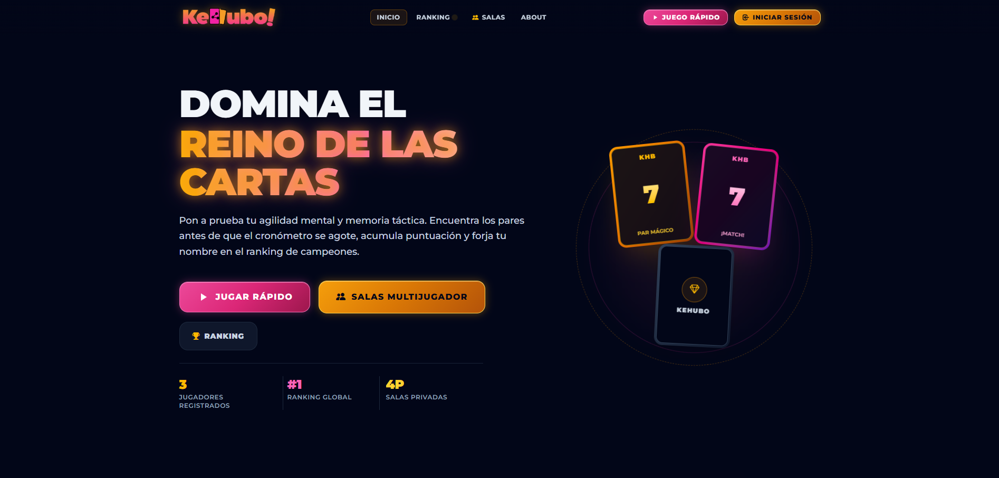
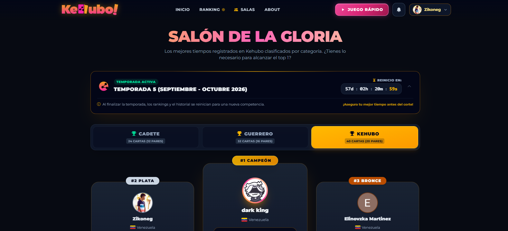
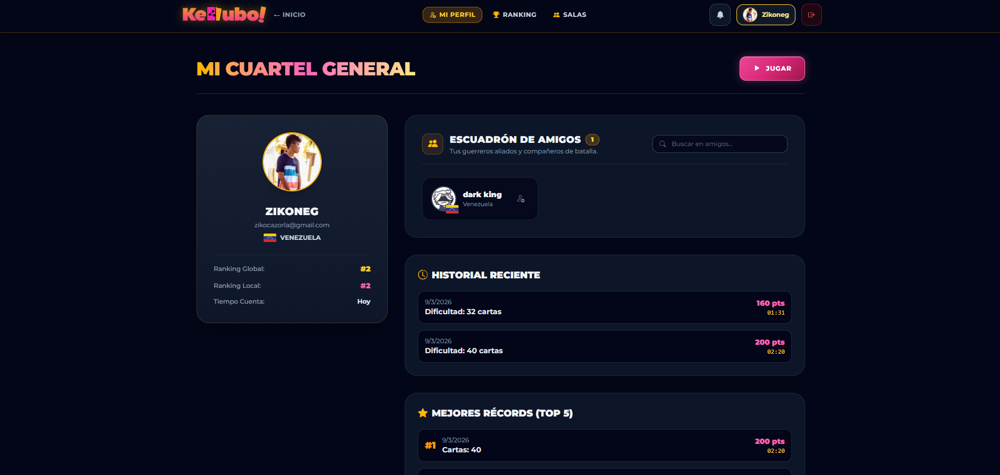
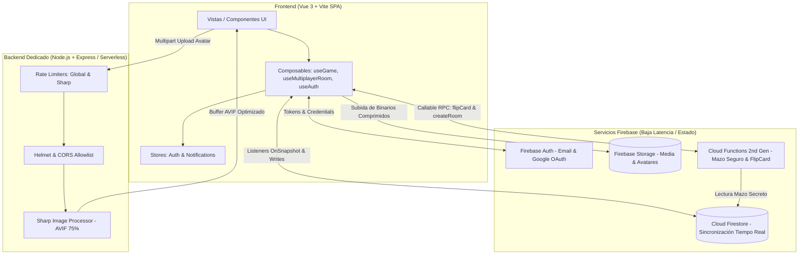

<p align="center">
  
</p>

# Kehubo — Plataforma de Juego de Memoria Táctica en Tiempo Real

> Videojuego web de emparejamiento táctico de cartas con partidas multijugador en tiempo real por salas privadas, leaderboard dinámico, sistema de ranking global, perfiles personalizables, arquitectura modular y compresión binaria de avatares.

**Demo en vivo:** [https://kehubo.vercel.app/](https://kehubo.vercel.app/)

---

## Gameplay en Vivo

<p align="center">
  
</p>

---

## Stack Técnico

### Frontend
- **Vue 3** (Composition API, `<script setup>`, Reactividad Nativa)
- **Vite** (Bundler y entorno de desarrollo de alto rendimiento)
- **TypeScript** (Tipado estricto en tipos de dominio, componentes y composables)
- **Pinia** (Gestión de estado global centralizado para autenticación y notificaciones)
- **Vue Router** (Enrutamiento SPA con rutas dinámicas nombradas y guardias de navegación)
- **Tailwind CSS 4** (Diseño moderno, dark mode, glassmorphism y micro-animaciones)
- **Anime.js & GSAP** (Animaciones tácticas de cartas, conteo regresivo y efectos de portal)
- **Bootstrap Icons** (Iconografía optimizada)

### Backend, Base de Datos y Servicios
- **Firebase Authentication** (Autenticación segura vía Email/Password y Google OAuth)
- **Cloud Firestore** (Base de datos NoSQL reactiva para estado de salas y sincronización en tiempo real)
- **Firebase Storage** (Almacenamiento en la nube de avatares de usuario)
- **Firebase Cloud Functions (2nd Gen)** (Generación server-side del mazo y verificación criptográfica de cartas)
- **Node.js & Express** (Servidor backend dedicado para procesamiento y compresión de medios)
- **Sharp** (Pipeline de manipulación y compresión de imágenes en memoria a formato AVIF)
- **Helmet & Express Rate Limit** (Seguridad de cabeceras HTTP y protección contra abuso y DoS)
- **Vercel** (Despliegue de frontend y backend serverless)

### Testing & Calidad de Código
- **Vitest** (Test runner de pruebas unitarias y de integración rápida)
- **@vue/test-utils & JSDOM** (Pruebas de componentes y composables reactivos)
- **Vue Component Modularizer Skill** (Arquitectura desacoplada basada en orquestadores y subcomponentes)

---

## Características Principales

- **Arquitectura de Componentes Modular**: Estructura desacoplada con orquestadores limpios y subcomponentes atómicos (`navbar`, `hero`, `features`, `footer`, `profile`, `multiplayer`, `ranking`) respaldados por un Design System unificado (`BaseButton`, `BaseModal`).
- **Autenticación y Perfiles**: Registro e inicio de sesión con validación en dos columnas, persistencia de sesión, selección de género y nacionalidad con banderas dinámicas.
- **Optimización de Avatares a AVIF**: Procesamiento binario en servidor mediante Sharp, recortando y convirtiendo imágenes a formato AVIF con reducciones superiores al 80% en tamaño de carga.
- **Modo Contrarreloj (Un Jugador)**: 4 dificultades tácticas (16, 24, 32 y 40 cartas), cálculo de puntuación dinámica, cartas viradas opcionales y control de temporizador.
- **Multijugador en Tiempo Real por Salas Privadas**: Creación de salas de hasta 4 jugadores con código alfanumérico único (`KH-XXXX`) o enlace directo.
- **Leaderboard Dinámico en Vivo**: Barra lateral interactiva que reordena automáticamente a los jugadores en tiempo real de mayor a menor puntuación y pares encontrados durante la partida.
- **Sistema Social y Notificaciones**: Envío y recepción de solicitudes de amistad en tiempo real con aceptación/rechazo y listas de amigos sincronizadas.
- **Ranking Global**: Tabla de clasificación con filtrado y persistencia en Firestore.

---

## Galería de la Interfaz

<p align="center">
  
</p>

<p align="center">
  
  
</p>

---

## Estructura de Componentes y Modularización

El proyecto sigue una arquitectura desacoplada donde cada vista principal o sección compleja actúa como un **Orquestador**, delegando responsabilidades a subcomponentes especializados:

```
src/
├── components/
│   ├── common/             # Componentes base del Design System (BaseButton, BaseModal)
│   ├── landing/            # Landing page modular
│   │   ├── navbar/         # Logo, DesktopNav, UserActions, MobileToggle, MobileMenu, navData
│   │   ├── hero/           # HeroContent, HeroStats, HeroCardPortal
│   │   ├── features/       # FeatureCard, featuresData
│   │   └── footer/         # FooterBrand, FooterNav, FooterContact, footerData
│   ├── multiplayer/        # LiveLeaderboard, RoomHeader, RoomPodiumModal, RoomWaitingLobby, etc.
│   ├── notifications/      # NotificationBell, NotificationItemCard, NotificationToast
│   ├── profile/            # ProfileHeader, ProfileStatsCard, ProfileMatchHistory, FriendsList, etc.
│   └── ranking/            # RankingPodium, RankingTable, RankingTypeFilter
├── composables/            # Lógica reactiva reutilizable (useGame, useMultiplayerRoom, useAuth, etc.)
├── stores/                 # Stores de Pinia (auth, notifications)
└── views/                  # Vistas de Vue Router (Home, Game, Profile, Ranking, Multiplayer)
```

---

## Arquitectura del Sistema

El proyecto implementa una arquitectura híbrida desacoplada diseñada para optimizar tanto la sincronización de baja latencia como las tareas computacionalmente pesadas de procesamiento binario:



### Justificación de la Separación de Backends
1. **Sincronización en Tiempo Real (Cloud Firestore)**: Gestiona el estado de salas multijugador, movimientos de cartas, amistades y notificaciones con latencia mínima mediante listeners basados en WebSockets/HTTP2.
2. **Procesamiento Binario Dedicado (Express + Sharp)**: El procesamiento y compresión de imágenes requiere operaciones intensivas de CPU y memoria nativa (C/C++ vía Sharp/libvips) que no deben ejecutarse en el cliente para no degradar el framerate del juego, ni sobrecargar Firestore con archivos sin optimizar.
3. **Lógica de Mazo en Servidor (Cloud Functions)**: Genera y custodia los valores reales del mazo en una subcolección privada inaccesible a clientes (`secret/deck`), revelando las cartas por RPC únicamente al voltearlas para impedir trampas mediante inspección de estado.

---

## Medidas de Seguridad e Integridad

La seguridad del sistema está estructurada en múltiples capas defensivas:

- **Mazo Protegido en Servidor (Anti-Cheat)**:
  - Los valores reales de las cartas se generan en Cloud Functions y se almacenan en `rooms/{roomId}/secret/deck`, bloqueada por reglas de Firestore. El documento público de la sala únicamente expone cartas con `valor: null`, evitando la lectura anticipada en DevTools.
- **Rate Limiting Estratificado**:
  - *Límite Global*: 100 peticiones por ventana de 15 minutos por IP para proteger endpoints generales.
  - *Límite de Compresión Estricto*: 20 conversiones por minuto por IP en `/api/compress-avatar` para mitigar ataques de Denegación de Servicio (DoS) por sobrecarga de CPU.
- **Protección de Cabeceras y CORS con Allowlist**:
  - Integración de **Helmet** con políticas `cross-origin` y `same-origin-allow-popups` compatibles con Firebase Auth.
  - Middleware de **CORS restrictivo** que valida orígenes contra la variable de entorno `ALLOWED_ORIGIN`, impidiendo llamadas no autorizadas desde dominios externos.
- **Reglas de Seguridad Granulares en Firestore (`firestore.rules`)**:
  - *Propiedad Estricta*: Los documentos de `users/{userId}` y `scores/{scoreId}` solo pueden ser creados, modificados o eliminados si `request.auth.uid == userId` o `resource.data.uid == request.auth.uid`.
  - *Integridad de Puntuaciones y Pares*: En salas multijugador, las reglas de `players/{playerId}` rechazan escrituras donde `score` o `pairsFound` decrezcan arbitrariamente, y validan que `pairsFound` no exceda físicamente `config.cardCount / 2`.
  - *Control de Salas*: La creación exige estructura válida (`code`, `status: 'waiting'`, `maxPlayers <= 4`) y la gestión de ciclo de vida queda reservada al `hostId`.
- **Sistema Anti-Fuerza Bruta**:
  - Mecanismo de limitación que bloquea intentos sucesivos tras 5 fallos durante 60 segundos, validado mediante pruebas unitarias.

---

## Testing y Calidad

El proyecto cuenta con una suite automatizada de pruebas con **Vitest** cubriendo los componentes críticos de la lógica de negocio y seguridad:

```bash
✓ tests/unit/useCountdown.test.js      # Temporizador, pausas e invocación de callbacks
✓ tests/unit/useCardDeck.test.js       # Generación de mazo, Fisher-Yates shuffle y pares
✓ tests/binary/imageCompression.test.js # Pipelines de compresión binaria de imagen
✓ tests/unit/security.test.js          # Guard anti-fuerza bruta y sanitización de inputs
✓ tests/unit/useGameTurn.test.js       # Lógica de emparejamiento, turnos y puntuación

Test Files  5 passed (5)
Tests       16 passed (16)
```

Para ejecutar las pruebas:
```bash
npm test
```

---

## Cómo Ejecutar el Proyecto Localmente

### Prerrequisitos
- Node.js (v18 o superior)
- NPM (v9 o superior)

### Instalación

1. Clonar el repositorio:
```bash
git clone https://github.com/DaCazo15/Kehubo.git
cd Kehubo
```

2. Instalar dependencias:
```bash
npm install
```

3. Configurar variables de entorno:
Crear un archivo `.env` o `.env.local` basado en `.env.example`:
```env
ALLOWED_ORIGIN=http://localhost:5173
PORT=3001
```

4. Iniciar el entorno completo de desarrollo:
```bash
# Inicia concurrentemente el cliente Vite, el backend Express y el watcher de tests
npm start
```

### Scripts Disponibles

| Comando | Descripción |
| :--- | :--- |
| `npm run dev` | Inicia el servidor de desarrollo frontend en `http://localhost:5173` |
| `npm run server` | Inicia el backend de compresión Express en `http://localhost:3001` |
| `npm run dev:all` / `npm start` | Ejecuta frontend, backend y tests de forma concurrente |
| `npm test` | Ejecuta la suite de pruebas unitarias una sola vez |
| `npm run test:watch` | Ejecuta Vitest en modo interactivo/watcher |
| `npm run build` | Compila y optimiza la aplicación para producción |
| `npm run preview` | Previsualiza el bundle compilado de producción localmente |
